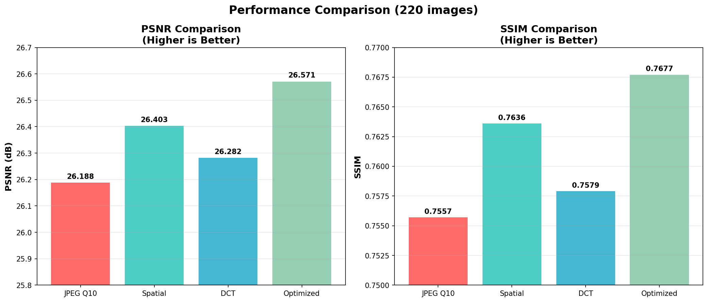

## JPEG Artifacts Reduction

This repository contains baseline and optimized methods for reducing JPEG blocking artifacts on the BSDS500 dataset and a small self-captured dataset.

All scripts are written in Python and use **relative paths**, so they can be run directly from this directory.

### 1. Environment

- Python 3.9+ (tested)
- Recommended to use a conda environment:

```bash
conda create -n jpeg-artifacts python=3.9
conda activate jpeg-artifacts
pip install opencv-python numpy scikit-image
```

If you plan to regenerate JPEG artifacts from GT images, you may also need:

```bash
pip install pillow
```

### 2. Data Layout

All data is stored under the `data` directory:

```text
JPEG-Artifacts-Reduction/
  data/
    BSDS500/
      GT/               # Ground truth images (200 BSDS500 images)
      JPEG_Q10/         # JPEG compressed images (quality = 10)
      JPEG_Q10_spatial/ # Output of spatial deblocking
      JPEG_Q10_dct/     # Output of DCT deblocking
      JPEG_Q10_optimized/ # Output of optimized spatial deblocking
    mydata/
      GT/               # 20 self-captured images
      JPEG_Q10/         # Corresponding JPEG compressed images
```

`GT` and `JPEG_Q10` folders are already provided. The deblocking scripts will create their corresponding output folders if they do not exist.

### 3. Running the Baseline Methods

All commands below assume the current working directory is the project root:

```bash
cd JPEG-Artifacts-Reduction
conda activate jpeg-artifacts
```

#### 3.1 Spatial Domain Baseline

Runs the simple spatial deblocking method that applies Gaussian blur along JPEG block boundaries:

```bash
python spatial_deblocking.py
```

This will:
- Read compressed images from `data/BSDS500/JPEG_Q10`
- Write deblocked images to `data/BSDS500/JPEG_Q10_spatial`

#### 3.2 DCT Domain Baseline

Runs the frequency-domain deblocking method that attenuates high-frequency DCT coefficients in the luminance channel:

```bash
python DCT.py
```

This will:
- Read compressed images from `data/BSDS500/JPEG_Q10`
- Write deblocked images to `data/BSDS500/JPEG_Q10_dct`

### 4. Running the Optimized Method

The optimized method is an adaptive spatial deblocking approach that:
- Detects block artifact strength at each block boundary
- Computes an adaptive blur weight map
- Blends the original and blurred images according to the weights

Run:

```bash
python optimized_spatial_deblocking.py
```

This will:
- Read compressed images from `data/BSDS500/JPEG_Q10`
- Write deblocked images to `data/BSDS500/JPEG_Q10_optimized`

### 5. Evaluating the Methods

To evaluate JPEG_Q10, Spatial, DCT, and Optimized methods against BSDS500 ground truth:

```bash
python eval_metrics.py
```

The script:
- Reads ground truth images from `data/BSDS500/GT`
- For each method, reads corresponding images from its folder
- Computes PSNR and SSIM for each image
- Prints the average PSNR and SSIM for all methods

### 6. Performance Visualization

The average PSNR and SSIM results for all four methods (JPEG_Q10, Spatial, DCT, Optimized) are summarized in the following figure:




